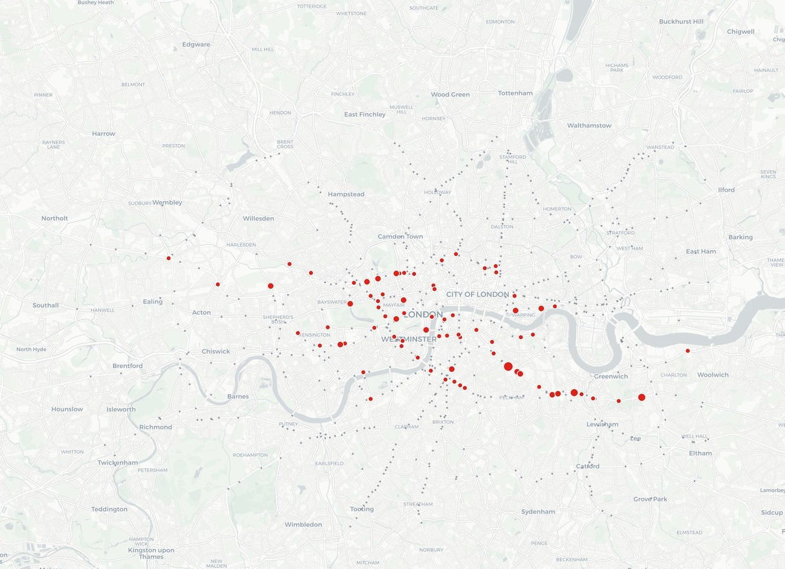
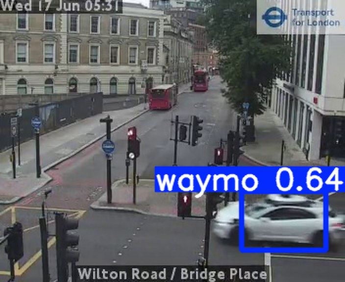
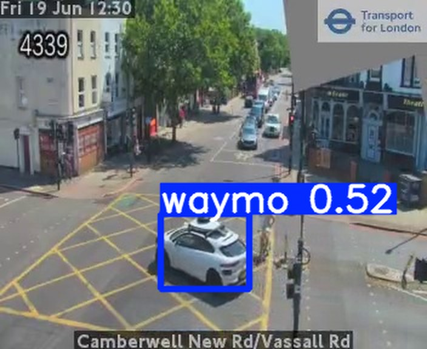
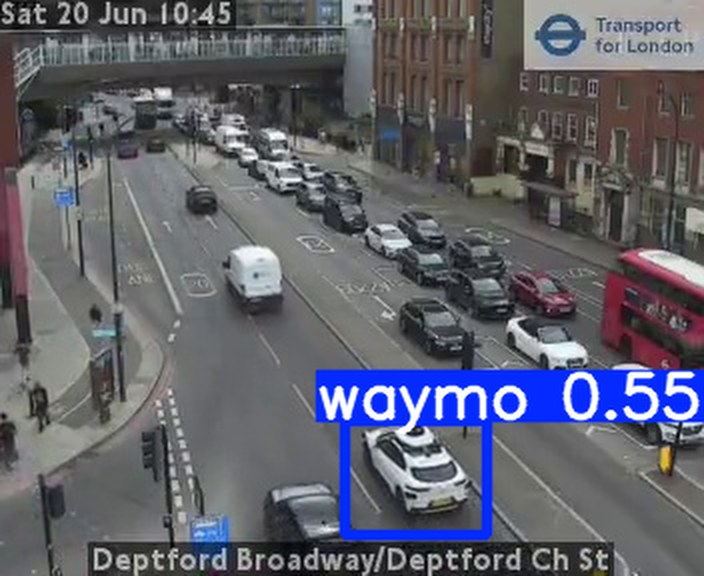
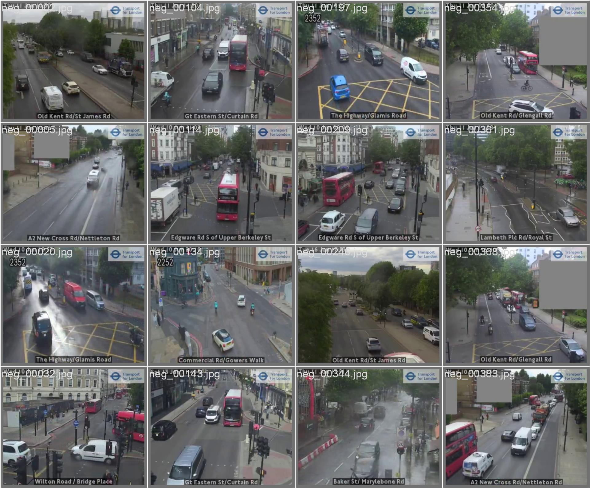
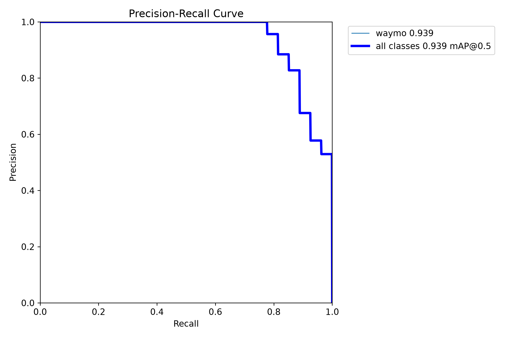
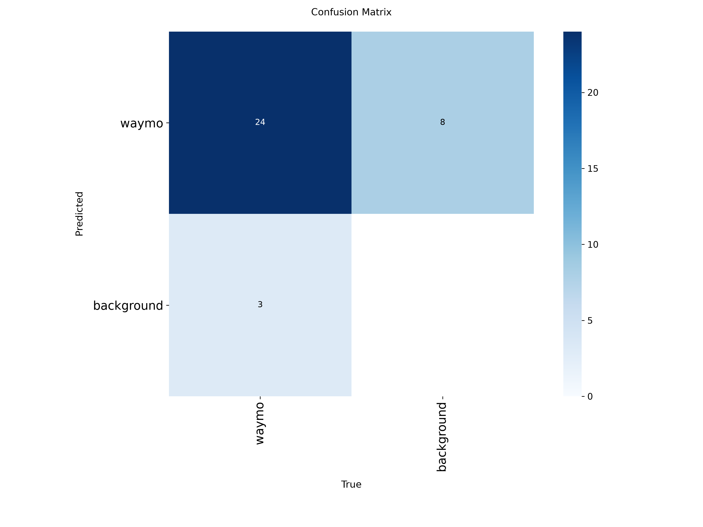
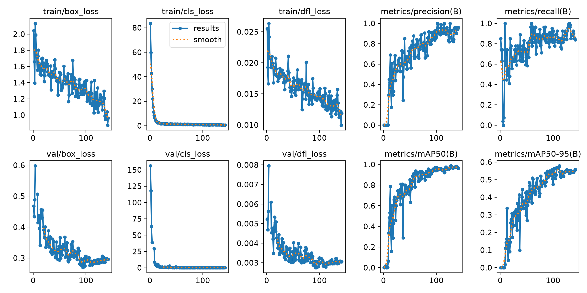

# Notes

*How a self-driving-car spotter was bootstrapped from London's traffic cameras — and what the first trained model can do.*

WaymoNet watches **TfL JamCam** traffic cameras and flags **Waymo**'s self-driving test cars: white Jaguar I-PACEs carrying a roof-mounted lidar **dome**, among other sensors . **Wayve** - coming next.

These notes cover two phases: **(1)** finding the first 100 confirmed Waymos by hand, and **(2)** the first model trained on that data — *RUN_1*.

---

## Phase 0 — 0 to 100

Wanted JamCam-specific data — decided to collect my own.

  

JamCams

~600 cameras polled every 150&nbsp;s

  
→

  

Detect&nbsp;+&nbsp;track

YOLO11n + ByteTrack best frame per vehicle

  
→

  

White only

cheap HSV gate — culls the obvious non-Waymos first, before any heavy compute

  
→

  

Roof score

MobileNetV3 embedding cosine vs “dome” centroid → rank

  
→

  

Human

top-ranked emailed I confirm / reject

  
→

  

Confirmed

100 Waymos · 76 cameras rejects → 7,488 hard negatives

After the culling of obvious rejects, the surviving candidates are sent to me for manual review.

↻ Every confirmation re-anchors the “dome” scorer on real roof crops, so the funnel sharpens as the data grows.

Scorer's weak at 352×288, often confused by roof boxes and police sirens. Only needed to surface Waymos well enough for them to reach me — while banking confirmed negatives.

<figure class="wide"><figcaption>Where we look vs where we find. Grey = the 683 cameras watched; red = the 101 Waymos confirmed at 77 of them. A wide net, but the sightings cluster in central and west-central London.</figcaption></figure>

---

## Phase 1 — RUN_1: the first trained model

With 100 real positives across 76 cameras, the data finally cleared the bar to train a proper detector.

**Recipe:** YOLO26s with a **P2 (stride-4) head** — the high-resolution feature map a 5–15 px dome needs — transfer-learned from COCO and trained at **704 px** on full-frame images plus the vetted negatives. About **19 minutes** on a single RTX 4090.

### It works

  <figure><figcaption>Wilton Road · 0.64</figcaption></figure>
  <figure><figcaption>held-out camera · 0.52</figcaption></figure>
  <figure><figcaption>held-out camera · 0.55</figcaption></figure>

*The model drawing its own boxes on frames from cameras it never trained on.*

### The numbers that matter

The ship decision isn't mAP — it's **recall versus false-positives on held-out cameras** (cameras absent from training), swept over the confidence threshold:

| Confidence | Recall | False positives | Precision |
|---|---|---|---|
| **0.10** | **96.3 %** | **0 / 162** | **100 %** |
| 0.15 – 0.35 | 92.6 % | 0 / 162 | 100 % |
| 0.50 | 66.7 % | 0 / 162 | 100 % |

**Zero false positives across 162 human-vetted negatives** — and those negatives include real rejected Wayves, so dome-vs-bar discrimination is tested on *real* data, not synthetic. A second pass over the curated hard-confuser galleries (non-Waymo I-PACEs, roof-box cars, vans): **0 / 52 fired**.

  <figure><figcaption>Predictions on a held-out batch</figcaption></figure>
  <figure><figcaption>Precision–recall (val)</figcaption></figure>
  <figure><figcaption>Confusion matrix</figcaption></figure>

<figure class="wide"><figcaption>Training &amp; validation curves — 142 epochs (early-stopped)</figcaption></figure>

### How it's applied

WaymoNet is an object **detector**, not a yes/no classifier. Per frame it emits boxes, each with a confidence ∈ [0, 1], and a threshold decides what counts as a sighting. Real Waymos land around **0.5–0.74**; the hard negatives produce *nothing* — a clean gap that lets a low cut (0.10) catch 96 % of Waymos with zero false alarms.

### Don't over-read RUN_1

This is a strong **baseline**, not a finished model. The held-out positive set is small (27 frames), so a single miss shifts recall by ~4 points — read these as a confident smoke test, not a final grade. The plan is to keep collecting and retrain on a larger, more camera-diverse set. RUN_1 is the number to beat.

---

*Powered by TfL Open Data. WaymoNet is an independent research project, not affiliated with Waymo, Wayve, or Transport for London.*
